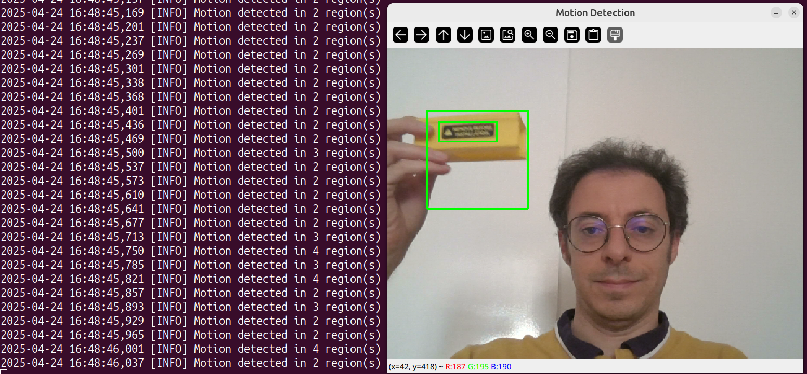
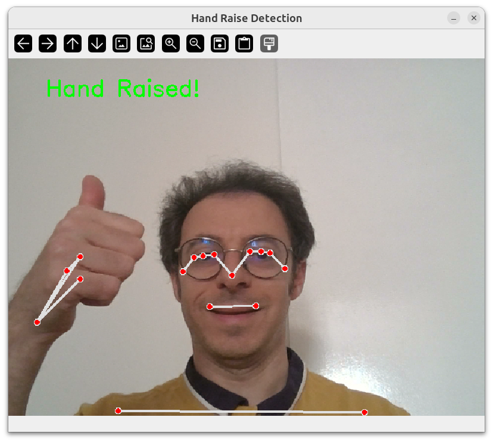

# Vision Engineering Exercises

Curated collection of Python exercises on classical computer vision (CV) and real-time data processing, designed with a focus on building robust, maintainable code and adhering to clean software engineering practices.

Originally developed for personal interview preparation and portfolio use, these exercises may also be useful for other engineers or technical reviewers evaluating practical CV and software engineering skills in Python.

## Key Areas Covered

- **Real-Time Data Processing**: Working with live data streams using techniques such as moving averages and staged processing pipelines.
- **Classical Computer Vision**: Implementing core CV algorithms like pose angle calculation, motion detection, and contour analysis.
- **Clean Coding and Best Practices**: Writing maintainable code that reflects solid engineering discipline.
- **Robustness**: Designing systems that gracefully handle edge cases, runtime errors, and unpredictable input data.

## Exercises

This repository contains the following exercises:

1. **Moving Average Smoother for Real-Time Sensor Data**: Implement a moving average smoother to filter noisy sensor data.
2. **Pose Angle Calculator from Keypoints**: Calculate angles between specific body parts from pose keypoints detected in images or video.
3. **Motion Detection in Video**: Detect and track motion in video streams, useful for security and monitoring applications.
4. **Contour Analysis**: Detect and analyze contours in images to extract and process shapes.
5. **Real-Time Pipeline Skeleton**: Implement a pipeline that processes video frames through multiple stages such as data source, processing, and output.
6. **Exception Handling and Logging**: Implement robust error handling and logging to ensure smooth operation and track issues.
7. **Bonus: Hand Raise Detection**: Detect if a person raises their hand above shoulder level based on pose keypoints.

## Requirements

- Linux operating system (tested on Ubuntu 24.04)
- Conda distribution (recommended version: 23.3.1+)
- Python 3 (recommended version: 3.12+)
- Required Python packages, listed in the `env/linux_conda_env.yml` Conda environment file

To install the dependencies, run:

```bash
conda env create -f env/linux_conda_env.yml
conda activate vision-eng
```

## Usage

Each exercise can be executed individually. Below are the commands to run each script:

### Moving Average Smoother for Real-Time Sensor Data

Apply a moving average smoother on real-time sensor data:
```bash
python package/smoother.py
```

### Pose Angle Calculator from Keypoints

Calculate angles between keypoints from pose detection:
```bash
python package/pose_angle_calculator.py
```

### Motion Detection in Video

Run the motion detection system on webcam input:
```bash
python package/motion_detector.py
```

Example result:



### Contour Analysis

Analyze contours in an image:
```bash
python package/contour_analysis.py
```


### Real-Time Pipeline Skeleton

Process video frames through a pipeline:
```bash
python package/pipeline.py
```

### Exception Handling and Logging

See the exception handling and logging in action:
```bash
python package/pipeline_with_logging.py
```

### Bonus: Hand Raise Detection

Detect if a person raises their hand based on pose landmarks:
```bash
python package/hand_raise_detection.py
```

Example result:




## Tests

To run the tests that validate the functionality of each component:
```python
python -m unittest discover tests
```

### License

MIT.